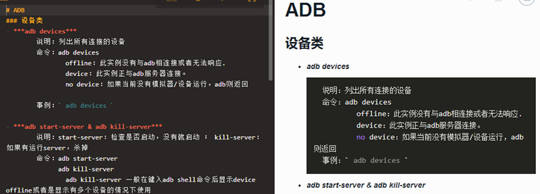

## Markdown 是什么

- Markdown 是一种轻量级标记语言。

- 它允许人们“使用易读易写的纯文本格式编写文档，然后转换成有效的XHTML(或者HTML)文档”。

- Markdown 吸收了很多在电子邮件中已有的纯文本标记的特性。

### Markdown有什么优点

#### 特点：

- **「易读易写」**

- ** 兼容 HTML**

#### Markdown的目标是：成为一种适用于网络的书写语言。

## Markdown的基本语法-区块元素

### 段落和换行  

一个 Markdown段落是由一个或多个连续的文本行组成，它的前后要有一个以上的空行。**普通段落不该用空格或制表符来缩进。**

- Code:

	这是一个段落。

	这是另一个段落。
	这不是另一个段落。

- View：

这是一个段落。

这是另一个段落。
这不是另一个段落。

### 标题

Markdown 支持两种标题的语法，类 Setext 和类 Atx 形式。

- code：
	类 Setext:
	
		This is an H1
		=============
	
		This is an H2
		-------------
	类 Atx：

		#### 这是 H4

		##### 这是 H5

- view：

#### 这是 H4	

##### 这是 H5

### 列表 

#### 无序列表

**无序列表使用星号、加号或是减号作为列表标记：**

- code：
	*   无序列表1
	+   无序列表2
	-   无序列表3

- view：
	+   Red	*   Green	-   Blue

#### 有序列表。

**有序列表则使用数字接着一个英文句点**

- code：

		1. Bird
		2. McHale
		- Parish

- view：

	1.  Bird
	2.  McHale
	3.  Parish  

### 代码区块

**要在 Markdown 中建立代码区块很简单，只要简单地缩进 4 个空格或是 1 个制表符就可以，例如，下面的输入**

- code：

		这是一个普通段落。

		<table>
    		<tr>
        		<td>Foo</td><td>Foo</td>
    		</tr>
		</table>

		这是另一个普通段落

- view：
    	
	这是一个普通段落。

	<table>
    	<tr>
        	<td>Foo</td><td>Foo</td>
    	</tr>
	</table>
	这是另一个普通段落。

## Markdown的基本语法-区段元素

### 强调：

**Markdown 使用星号（*）和底线（_）作为标记强调字词的符号**

- code：

		test

		*stest*

		__test__

		**_test_**

- view：

	test

	*test*

	__test__

	**_test_**

### 链接

Markdown 支持两种形式的链接语法： 行内式和参考式两种形式。不管是哪一种，链接文字都是用 [方括号] 来标记。

- code：

		行内式：
			[This link](http://blog.bihe0832.com/) has no title attribute.
		参考式：
			This is [an example][id] reference-style link.
			[id]: http://blog.bihe0832.com  "Optional Title Here"

- view：

	行内式：

	[This link](http://blog.bihe0832.com/) has no title attribute.

	参考式：

	This is [an example] [1] reference-style link.

	[1]: http://blog.bihe0832.com/ "Optional Title Here"

### 代码片段：

如果要标记一小段行内代码，你可以用反引号把它包起来（`）

- Code：

		Use the `printf()` function.

		A backtick-delimited string in a code span: `` `foo` ``

- View：

	Use the `printf()` function.

	A backtick-delimited string in a code span: `` `foo` ``

### 图片：

Markdown 使用一种和链接很相似的语法来标记图片，同样也允许两种样式： 行内式和参考式。

#### 行内式的图片语法：

- Code：

		
- View：

	

#### 参考式的图片语法：

- Code：

		![Alt text][2]
		[2]: ../public/images/img1.png  "Optional title attribute" 

- View：

![Alt text][2]
[2]: ../public/images/img1.png  "Optional title attribute"
	

到目前为止， Markdown 还没有办法指定图片的宽高，如果你需要的话，你可以使用普通的  标签。

### 转义字符：

Markdown 可以利用反斜杠来插入一些在语法中有其它意义的符号。Markdown 支持以下这些符号前面加上反斜杠来帮助插入普通的符号：

	\   反斜线
	`   反引号
	*   星号
	_   底线
	{}  花括号
	[]  方括号
	()  括弧
	#   井字号
	+   加号
	-   减号
	.   英文句点
	!   惊叹号

## Markdown 免费编辑器

#### Windows 平台
- MarkdownPad： [http://markdownpad.com/](http://markdownpad.com/)
- MarkPad： [http://code52.org/DownmarkerWPF](http://code52.org/DownmarkerWPF)

#### Mac 平台

- **Mou：** [http://mouapp.com](http://mouapp.com)

#### 在线编辑器

- Markable.in： [http://markable.in](http://markable.in)
- Dillinger.io：[http://dillinger.io](http://dillinger.io)
- stackedit.io：[https://stackedit.io/editor](https://stackedit.io/editor)

#### 浏览器插件

- MaDe (Chrome)：[MaDe](https://chrome.google.com/webstore/detail/oknndfeeopgpibecfjljjfanledpbkog)
- 马克飞象：[http://maxiang.info/](http://maxiang.info/)

## 参考文章：

##### Markdown 介绍PPT：[http://show.bihe0832.com/markdown.html](http://show.bihe0832.com/markdown.html)