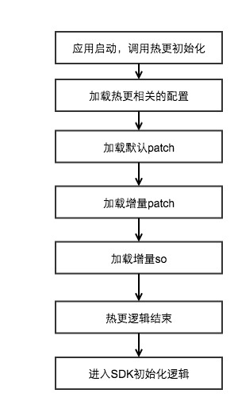

### 写在前面

本文是SDKHotfix相关的SDK热更系列文章中的一篇，以下为项目及系列文章相关链接：

- **SDKHotfix整体介绍**：[http://blog.bihe0832.com/sdk_hotfix_project.html](http://blog.bihe0832.com/sdk_hotfix_project.html)

- **SDKHotfix对应github地址**：[https://github.com/bihe0832/SDKHoxFix](https://github.com/bihe0832/SDKHoxFix)

---

## 项目说明

**该项目主要是提供给SDK的开发者使用，提供了SDK开发者如何实现SDK自身热更新（包括Java代码和Native），如果是APP的开发者了解应用的热更新，建议参考dodola的HotFix项目，里面介绍的更全面。**

**为了降低项目的理解难度，关于java热更新，该项目暂时不会涉及怎么管理版本号、怎么在代码中插桩、怎么生成版本差异包、怎么将差异包编为dex文件等内容，这部分内容我会在另外的项目来介绍。**

**为了降低项目的理解难度，关于so的热更新，该项目暂时仅使用arm的so，关于如何在热更时根据so的类型来选择下发什么类型的so，请参考作者之前的文章 [SDK热更之如何获取应用在当前设备上的so对应的指令集
](http://blog.bihe0832.com/sdk_hotfix_so_abi.html)。**

**由于本项目重点介绍重点SDK的热更新相关的内容，因此项目中的代码虽然是实现简单的功能，但是使用了SDK和demo等多个项目以及java和Native多层调用。**本项目中不会再介绍SDK相关的内容，建议可以先通过下面的链接了解这个项目的结构，然后再看热更新项目的内容，[点击了解Android-gradle-jni-so](https://github.com/bihe0832/Android-gradle-jni-so)。

## 代码介绍

- **项目对应github地址：[https://github.com/bihe0832/HoxFix](https://github.com/bihe0832/SDKHoxFix)**

### 1. 工程介绍

	SDKHoxFix
		│
		├─── BuildPatch SDK自动插桩、自动生成补丁的插件工程
		│
		├─── GradleTest 普通的Android应用工程，调用了SDK提供的相关函数，也就是SDK的使用者
		│
		├─── MD5 SDK项目的工程，最终打包后对外提供jar包和so，本项目主要也是介绍他的热更新
		|
		├─── build.sh SDK相关的自动构建脚本，生成SDK的jar、so、Demo、补丁文件
		│
	   	└─── README.md 项目介绍

#### 备注：后面的内容都重点介绍整个热更新相关的内容，这里补充一下目前的demo项目存在的一些注意事项。

1. SDK的生成只能用命令行，因为分包生成支持热更的SDK是通过shell脚本实现的，直接gradle生成的jar并不可用
2. Demo中，下载更新直接在主线程，而且没有回调，这里可以优化，因为为了介绍热更，因此对这里没有做太复杂的处理

### 2. 关键文件介绍

#### 默认patch

对应本项目，就是bihe0832_hackdex.jar，是一个dex文件，里面仅包含插桩用的com.bihe0832.hotfix.Fix的代码。是解决预校验的关键类，需要打包进SDK的jar包，否则在Android的低版本会有问题。

### 3. 关键操作介绍

#### 默认patch生成

目前因为默认patch是固定的，因此是通过手动生成。主要包括以下几步

- 拿到SDK编译后的完整jar
- 解压jar、删除除com.bihe0832.hotfix.Fix以外的所有代码
- 将com.bihe0832.hotfix.Fix的class打包为jar
- 用build工具将jar生成为dex（方法与生成patch包方法一致）

#### 代码插桩并生成支持热更新的SDK 

关于代码插桩可以参考[SDK热更之如何在SDK代码中自动插桩及如何生成补丁包](http://blog.bihe0832.com/sdk_hotfix_patch.html)中相关的说明。插桩后默认生成的jar因为没有实现代码分包，还包含插桩类，因此会带来预校验的问题，因此我们需要对SDK代码分包和做一些预处理，具体做法包括：

- 拿到SDK编译并插桩后的完整jar
- 解压jar，删除com.bihe0832.hotfix.Fix文件
- 把默认patch等其余热更需要的文件添加到jar的assets文件
- 把所有内容重新打成新的jar

#### 生成补丁包

Demo中关于补丁包生成通过自动构建生成，关于这部分内容可以参考[SDK热更之如何在SDK代码中自动插桩及如何生成补丁包](http://blog.bihe0832.com/sdk_hotfix_patch.html)中关于热补丁生成相关的说明。主要流程为：

- 拿到SDK编译后的完整jar
- 解压jar，删除com.bihe0832.hotfix.Fix文件
- 与老版本对比，删除所有没有变化的文件
- 把所有内容重新打成新的jar
- 用build工具将jar生成为dex

### 4. SDK初始化及热更流程

**为了保证尽可能多的SDK的代码可以通过热更新更新，因此SDK通过先初始化热更模块，然后再初始化SDK的方法，而且比较多的使用了反射来杜绝代码引用引起的无法热更。**

- **SDK初始化简单流程**

