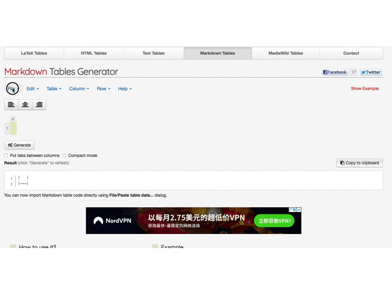
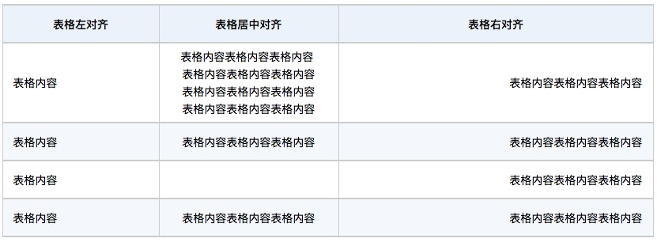

从很早开始就热衷于使用markdown以及推广markdown，效果都还不错。目前个人基本上所有的文档都是使用markdown来书写。用的久了就会遇到一些之前没有遇到的奇奇怪怪的问题，以及一些经验总结，在这里集中记录一下，方便后续查找。

## 表格

其余通用的一些markdown的用法或者标签就不介绍了，这里重点介绍一下表格相关的内容。当使用markdown制作表格时，经常会遇到下面的问题：

- 表格前期填充内容的同时还需要关注行列内容是否对齐，当空行较多是比较麻烦
- 表格中内容的对齐，各种左中右对齐
- 表格内容较多，尤其是某一列内容过多时，由于宽度自适应导致排版很丑

对于这三个问题，可以分别通过下面的方法来解决

#### 内容填充

Tables Generator 是一个可以在线快速生成 Text、Markdown 格式等多种格式表格的工具，支持在表格中填充数据，保证排版整齐，而且支持将Excel等的表格转化为markdown的格式，生成复制以后即可使用。

- 网址：[https://www.tablesgenerator.com/markdown_tables](https://www.tablesgenerator.com/markdown_tables)

- 使用示例：

	

#### 表格对齐

表格中内容的对齐可以直接依靠markdown提供的标签来设置，通过添加 “`:`”来控制，下面直接上示例（由于博客有css样式，会重置，因此放上截图）：

- 应用效果

	

- 对应源码
	
		| 表格左对齐 | 表格居中对齐 | 表格右对齐 |
		|:--|:--:|--:|
		| 表格内容表格内容表格内容 | 表格内容表格内容表格内容 | 表格内容表格内容表格内容 |

#### 表格格式

相比表格的对齐，表格的格式就相对复杂，由于mardkdown本身并不提供表格格式的设置标签，因此我们只能通过css来设置，同样上示例（由于博客有css样式，会重置，因此放上截图），同时在代码中添加足够多的注释方便更多人使用。

- 应用效果

	

- 对应源码
	
		
	
		| 表格左对齐 | 表格居中对齐 | 表格右对齐 |
		|:--|:--:|--:|
		| 表格内容 | 表格内容表格内容表格内容   表格内容表格内容表格内容 表格内容表格内容表格内容 表格内容表格内容表格内容 | 表格内容表格内容表格内容 |
		| 表格内容 | 表格内容表格内容表格内容 | 表格内容表格内容表格内容 |
		| 表格内容 |  | 表格内容表格内容表格内容 |
		| 表格内容 | 表格内容表格内容表格内容 | 表格内容表格内容表格内容 |

## 基于markdown的云端笔记

一直以来，日常笔记的云端同步都都很头痛，之前试用了很多，从印象笔记、到有道云笔记、到oneNote、再到使用自己搭的git，都或多或少有一些缺点。从去年中逛github的时候看到了目前用的boostnote以后，发现终于找到了一款到目前为止用的很顺手的笔记软件。废话不多，放上相关的地址和简单总结吧。

- 官网地址： [https://boostnote.io](https://boostnote.io)

- 在线体验地址：[https://boostnote.io/demo/](https://boostnote.io/demo/)
- 优点：
	- UI 自定义
	- 支持代码格式
	- 支持markdown
	- 分组存储
	- 结合Dropbox或者微云实现云端备份
	- 剪贴板图片直接粘贴
	- 开源
	- 全平台
- 缺点：
	- 默认格式不是markdown
	- 无法直接导出为pdf或者图片
